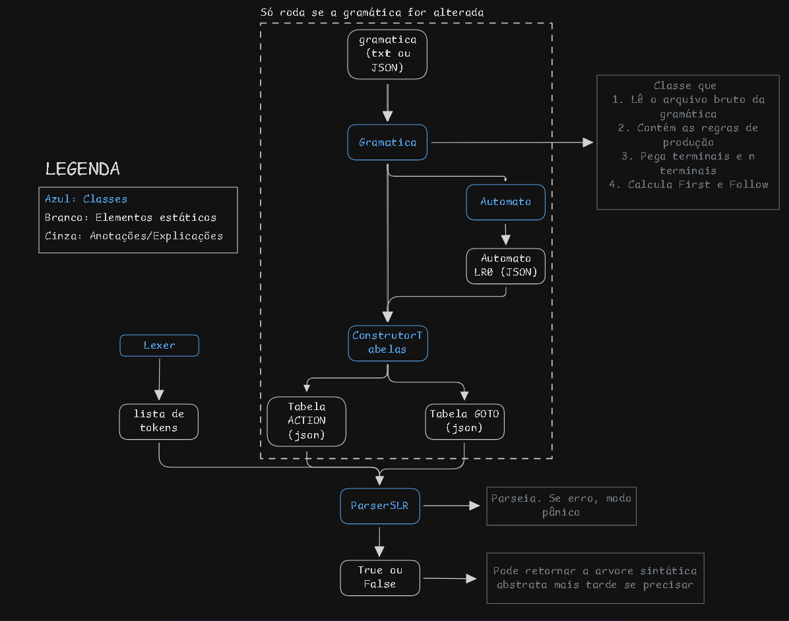

# 🏗️ Rascunho de Arquitetura: Analisador Sintático SLR(1)

Classes, divisão de responsabilidades das classes e ideia para o fluxo de processamento. Alguns nomes/labels podem estar diferentes no código, na imagem e nos textos abaixo. 

## 1. Arquitetura de Classes Proposta

O projeto é dividido em dois ecossistemas: o gerador offline (que processa a gramática) e o compilador online (que consome a tabela gerada).

### Ecossistema 1: O Gerador SLR (`gerador_slr.py`)
Roda apenas quando a linguagem/gramática sofrer alterações para recalcular o cérebro do analisador.

*   **`Gramatica`**:
    *   **Responsabilidade**: Ler o arquivo `gramatica.txt`.
    *   **Métodos Principais**: `calcular_first()`, `calcular_follow()`. Identifica terminais e não-terminais.
*   **`ItemLR`**:
    *   **Responsabilidade**: Estrutura simples para representar um item do autômato (ex: `<S'> -> . <chs>`). Guarda a regra, o lado esquerdo e a posição do "ponto" (dot) de transição.
*   **`AutomatoLR0`**:
    *   **Responsabilidade**: Processar a `Gramatica` gerando todos os itens validos.
    *   **Métodos Principais**: `closure(item)`, `goto(estado, simbolo)`. Gera todos os estados possíveis.
*   **`ConstrutorTabelas`**:
    *   **Responsabilidade**: Unir o Autômato e os conjuntos Follow para gerar a tabela.
    *   **Métodos Principais**: `construir_action()`, `construir_goto()`, `exportar_tabelas()` (salva a matriz final em um arquivo `.json`).

### Ecossistema 2: O Compilador Principal (Orquestrador)
É a esteira principal que roda quando queremos compilar um código da linguagem `C-Hurras`.

*   **`Token`**:
    *   **Responsabilidade**: Classe de modelo simples. Guarda string, categoria e linha.
*   **`Lexer`** (em `analisador_lexico.py`):
    *   **Responsabilidade**: Fazer varredura de caracteres.
    *   **Métodos Principais**: `__init__(codigo_fonte)`, `gerar_tokens()`.
*   **`ParserSLR`** (em `analisador_sintatico.py`):
    *   **Responsabilidade**: O núcleo da Fase 2. Uma máquina orientada a pilha e tabela.
    *   **Métodos Principais**: 
        *   `__init__(tabelas_json, regras_json)`: Recebe as tabelas já prontas e as regras para saber o tamanho de redução.
        *   `parse(lista_tokens)`: O loop principal Shift-Reduce.
        *   `modo_panico(token_atual)`: Trata as células de erro da tabela ACTION.

---

## 2. Sequência de Chamadas (Fluxo de Execução)

O fluxo de dados ao compilar um código fonte (ex: `codigo.churras`):

1.  **Pré-requisito**: O arquivo de tabelas (`tabelas_slr.json`) já foi gerado offline por `gerador_slr.py`.
2.  **Início**: O arquivo principal inicia lendo o código-fonte em texto do arquivo `.churras`.
3.  **Chamada Léxica**:
    *   Instancia `lexer = Lexer(codigo_texto)`.
    *   Chama `lista_tokens = lexer.gerar_tokens()`.
    *   O retorno é um array/lista de objetos `Token`. Erros léxicos são relatados aqui.
4.  **Chamada Sintática**:
    *   Instancia o parser carregando as tabelas: `parser = ParserSLR("tabelas_slr.json")`.
    *   Inicia a análise passando a fita léxica: `parser.parse(lista_tokens)`.
5.  **Loop Shift-Reduce (`parse()`)**:
    *   O Parser inicia a Pilha de Estados colocando `[ 0 ]`.
    *   Para cada token na `lista_tokens`:
        *   `estado_topo = pilha[-1]`
        *   Consulta na tabela: `acao = ACTION[estado_topo][token.categoria]`.
        *   Se `acao` == **Shift(N)**: Coloca o token e o Estado **N** na pilha. Avança a fita de tokens.
        *   Se `acao` == **Reduce(Regra)**: Desempilha instâncias da pilha baseado no tamanho da regra. Consulta a tabela `GOTO` usando o estado remanescente no topo e o Não-Terminal reduzido. Empilha o novo estado. *A fita do token **não** avança nesta operação.*
        *   Se `acao` == **Accept**: Sucesso! O código está sintaticamente correto. Fim do laço.
        *   Se `acao` == **Erro**: Aciona `modo_panico(token)`.
6.  **Recuperação de Erros (Modo Pânico)**:
    *   A função iterativamente descarta tokens da fita e desempilha a pilha de estados até encontrar os pontos de sincronização (como um `;`).
    *   Realinha a máquina de estados para evitar travamento em cascata e devolve o controle ao Loop.
7.  **Fim do Programa**: Relatório de status é impresso para o usuário indicando as falhas reportadas ou o sucesso pleno.
